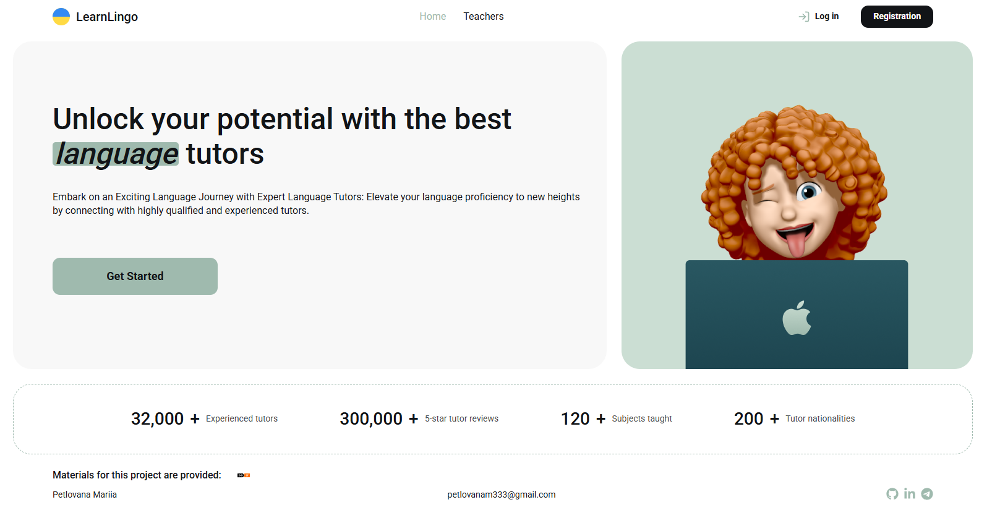
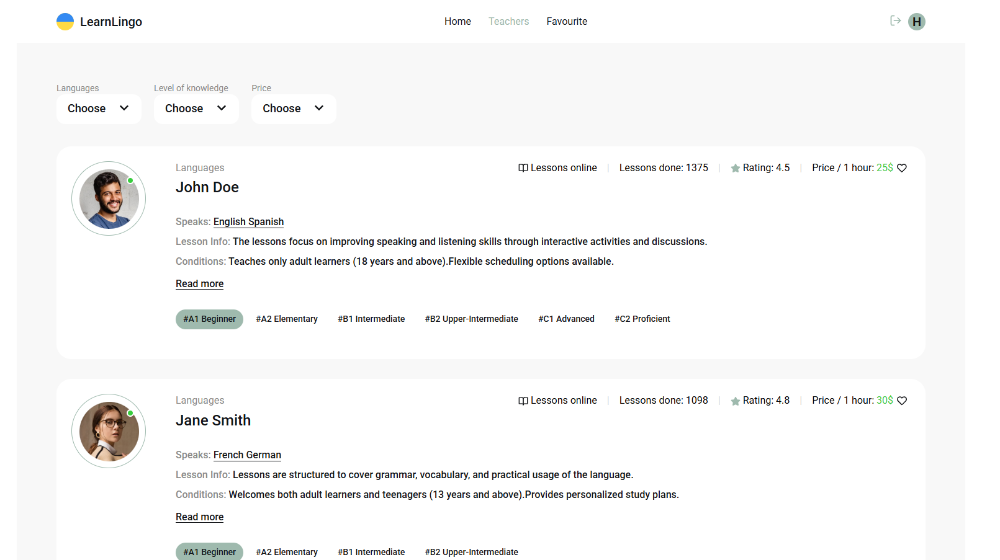
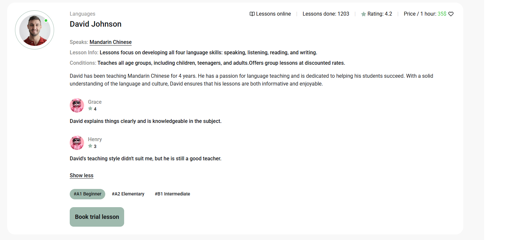
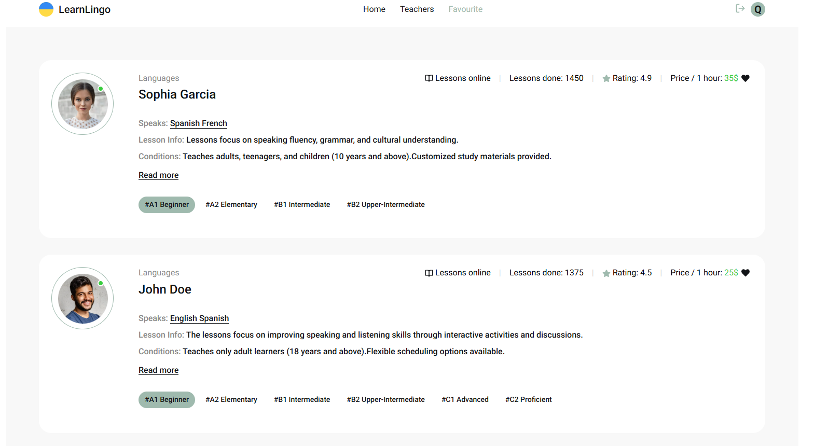
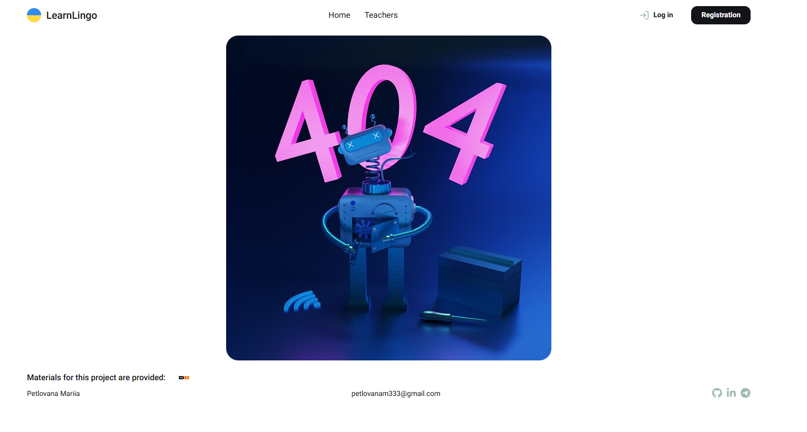
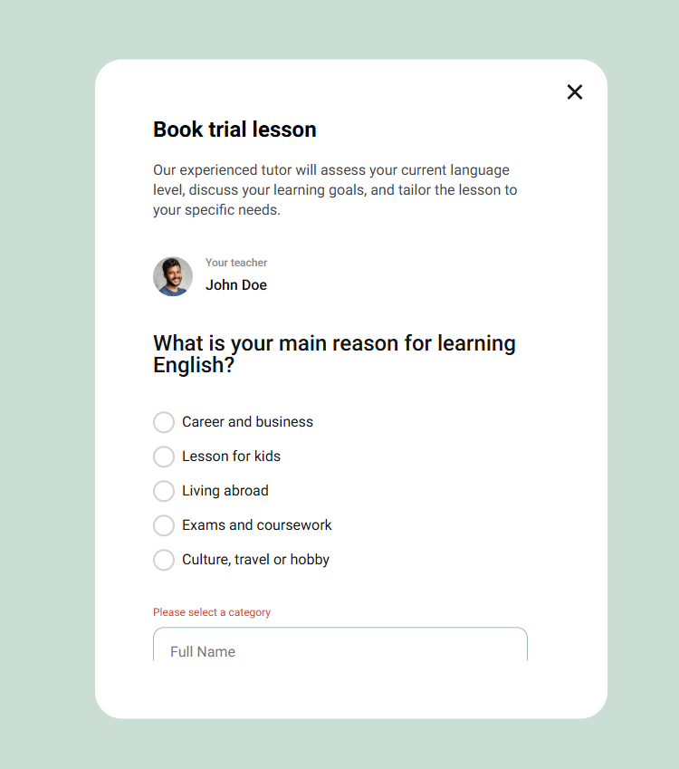
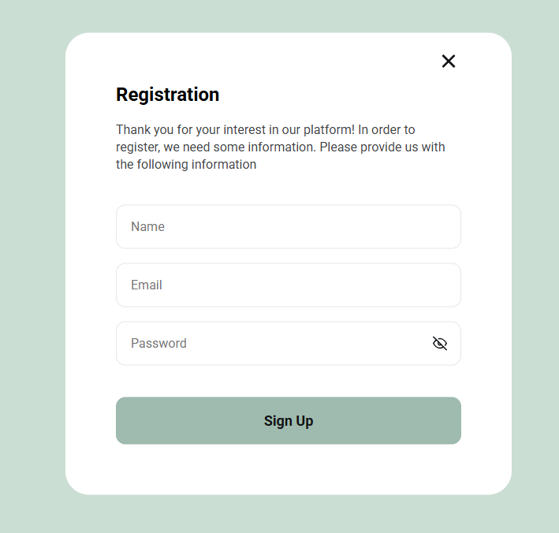

# LearnLingo 🔥🔥🔥

## 📌 Project Description

**LearnLingo** is a web application for a language learning company that offers online
lessons with teachers. Users can browse a list of teachers, filter them based on language,
student level, and price per hour. They can also add teachers to their favorites list
after logging in. The app also allows users to book trial lessons with teachers.

## 🔗 Demo

- [Deployed on Vercel](https://teachers-beta.vercel.app/)
- [GitHub Repository](https://github.com/Mariia-Petlovana-91/Teachers)

## 📜 Main Features

- 📌 **Home Page** — A page that introduces the company and offers a call-to-action to
  start using the app, linking to the **Teachers** page.
- 🚶‍♂️ **Teachers Page** — Displays a list of teachers. Users can filter teachers based on
  language, student level, and price per hour. New teachers are loaded dynamically when
  the "Load More" button is clicked.
- ⭐ **Favorites** — A private page where authorized users can view the teachers they have
  added to their favorites.
- 💬 **Teacher Details** — Users can view detailed information about each teacher,
  including their reviews, qualifications, and more.
- 🔄 **Pagination** — Users can load more teachers by clicking the "Load More" button,
  which triggers an API call to fetch more data.
- 🔒 **Authorization** — Users can register, log in, and log out. Authentication is
  handled via Firebase Authentication.
- 💖 **Add to Favorites** — Authenticated users can add or remove teachers from their
  favorites list.
- 📅 **Booking Form** — Authenticated users can book trial lessons with teachers through a
  modal form.

## 📍 Routing

- `/` – **Home Page**
- `/teachers` – **Teachers Page**
- `/favorites` – **Favorites Page**
- `*` – **Not Found Page**

## ⚙️ Technologies

| Technology      | Description      |
| --------------- | ---------------- |
| React           | Main library     |
| Vite            | Bundler          |
| Redux Toolkit   | State management |
| React Router    | Routing          |
| React Hook Form | Form handling    |
| Yup             | Validation       |
| Firebase        | Authentication   |
| React Hot Toast | Notifications    |
| ESLint          | Code linter      |
| Prettier        | Code formatter   |
| React Icons     | Icon library     |
| Sass            | Preprocessor     |

## 🗄 API

This project uses Firebase Realtime Database to store and retrieve teacher data.

## 🖼 Screenshots

### Home Page

### Teachers Page

## Read More Item

### Favorites Page

### Not Found Page

### Booking Form

## LogIn Form

### Registration Form

### Technical Specifications

- **Firebase Realtime Database**: Handles teacher data and user favorites list.
- **React Router**: For navigating between pages.
- **React Hook Form & Yup**: For form handling and validation (e.g., booking form,
  registration, and login forms).

## ✨ Materials for this project are provided [GoIt](https://www.googleadservices.com/pagead/aclk?sa=L&ai=DChcSEwi41Ku7y_GLAxXLR5EFHeuQBCEYABAAGgJscg&co=1&gclid=CjwKCAiA5pq-BhBuEiwAvkzVZeosMp0g2-bgZq1Ch3uh0NGc4OfYDqZrtSunzdDrkFV4zlC5XoE5iBoCRgYQAvD_BwE&ohost=www.google.com&cid=CAESVOD2eYjBowlv0Fzgm-qpiUS14QI2J21-y2o0MZfPmtHAtem227N_X1FC0US-b8V2TjURLS5v9H7miGGXN8JgKthxOW0GbkyOeFy0_M42g10NXQuEXw&sig=AOD64_28sKgTC_NgJp5Vv07ngXx-LQ25PA&q&adurl&ved=2ahUKEwibk6e7y_GLAxVQGxAIHVCaANsQ0Qx6BAgYEAE)

- [Maket](https://www.figma.com/file/dewf5jVviSTuWMMyU3d8Mc/%D0%9F%D0%B5%D1%82-%D0%BF%D1%80%D0%BE%D1%94%D0%BA%D1%82-%D0%B4%D0%BB%D1%8F-%D0%9A%D0%A6?type=design&node-id=0-1&mode=design&t=jCmjSs9PeOjObYSc-0)
- [TASK](https://docs.google.com/document/d/1ZB_MFgnnJj7t7OXtv5hESSwY6xRgVoACZKzgZczWc3Y/edit?tab=t.0)

## 💥⏬⏬⏬💥

- [Сompany website GoIt](https://www.googleadservices.com/pagead/aclk?sa=L&ai=DChcSEwi41Ku7y_GLAxXLR5EFHeuQBCEYABAAGgJscg&co=1&gclid=CjwKCAiA5pq-BhBuEiwAvkzVZeosMp0g2-bgZq1Ch3uh0NGc4OfYDqZrtSunzdDrkFV4zlC5XoE5iBoCRgYQAvD_BwE&ohost=www.google.com&cid=CAESVOD2eYjBowlv0Fzgm-qpiUS14QI2J21-y2o0MZfPmtHAtem227N_X1FC0US-b8V2TjURLS5v9H7miGGXN8JgKthxOW0GbkyOeFy0_M42g10NXQuEXw&sig=AOD64_28sKgTC_NgJp5Vv07ngXx-LQ25PA&q&adurl&ved=2ahUKEwibk6e7y_GLAxVQGxAIHVCaANsQ0Qx6BAgYEAE)

## 👨‍💻 Author

**Petlovana Mariia**  
📧 Email: petlovanam333@gmail.com
